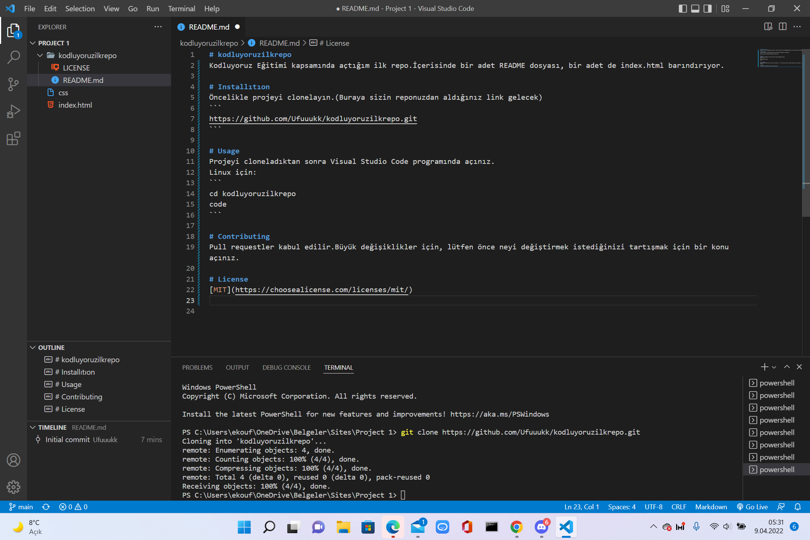

# kodluyoruzilkrepo
Kodluyoruz Eğitimi kapsamında açtığım ilk repo.İçerisinde bir adet README dosyası, bir adet de index.html barındırıyor.

# Installıtıon
Öncelikle projeyi clonelayın.(Buraya sizin reponuzdan aldığınız link gelecek)
```
https://github.com/Ufuuukk/kodluyoruzilkrepo.git
```

# Usage 
Projeyi cloneladıktan sonra Visual Studio Code programında açınız.
Linux için:
```
cd kodluyoruzilkrepo
code
```

# Contributing
Pull requestler kabul edilir.Büyük değişiklikler için, lütfen önce neyi değiştirmek istediğinizi tartışmak için bir konu açınız.

# License 
[MIT](https://choosealicense.com/licenses/mit/)



[patika](https://www.patika.dev/tr)
